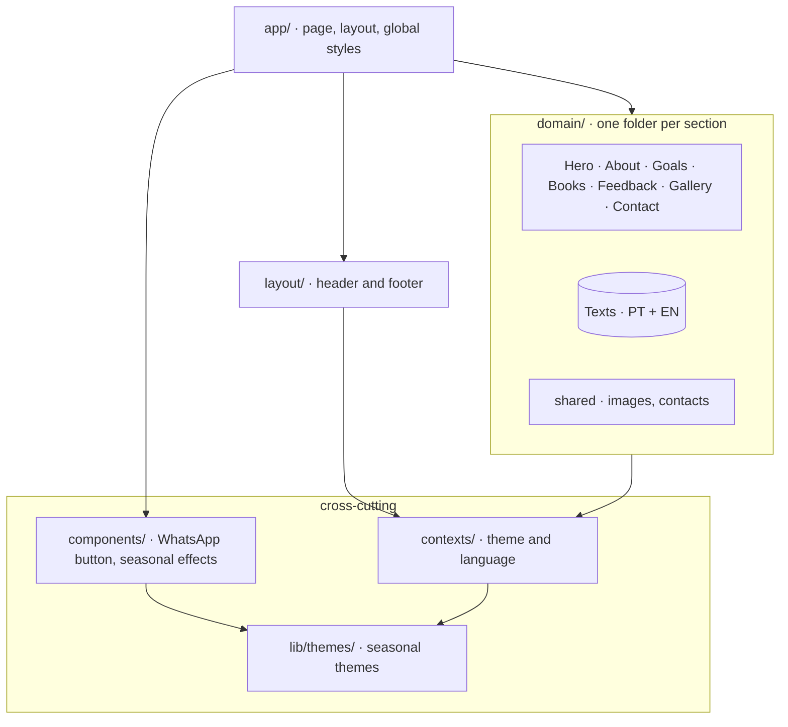

# LondonLink

Landing site for **LondonLink**, an English school for Brazilian Portuguese
speakers that builds a course around each student's goals. One page, in
Portuguese and English, with themes that follow the calendar.


## Highlights

- **Bilingual.** Every section in Portuguese (default) and English; the choice
  is remembered, and `<html lang>` follows it before the page even paints.
- **Seasonal themes.** Carnival and Easter (computed each year), Valentine's
  Day, Halloween, Christmas and New Year switch the palette and add their own
  effects on their dates; the rest of the year uses the default theme.
- **Light, dark or automatic**, remembered per visitor, applied without a
  flash on load.
- **Accessible.** Built to WCAG 2.2 AA: landmarks and a skip link, keyboard
  access, visible focus, named icon buttons, reduced-motion support in every
  seasonal effect.
- **Fast and static.** The page is prerendered to HTML and served with
  optimized images; JavaScript handles the interactive parts.
- **Hardened.** Content Security Policy and the OWASP security headers on
  every response; a dependency audit runs on every pull request.
- **Easy to reach.** A floating WhatsApp button in the same corner on every
  screen, and the school's location on a map.

## Sections

Hero · About · Goals · Books · Student feedback · Gallery · Contact

## Built with

[Next.js](https://nextjs.org) (App Router, static prerender) ·
[React](https://react.dev) · [Tailwind CSS](https://tailwindcss.com) ·
TypeScript · ESLint · Prettier · pnpm.

## Run it locally

Requires the current Node.js LTS (`nvm use` reads `.nvmrc`) and pnpm at the
version pinned in `package.json` (`corepack enable` once activates it). Use
pnpm only — npm or yarn would write a second lockfile.

```bash
pnpm install     # also installs the pre-commit hook
pnpm dev         # http://localhost:3000
```

| Command | What it does |
|---|---|
| `pnpm build` / `pnpm start` | Production build, then serve it on port 3302 |
| `pnpm lint` | Lint code and stylesheets (zero warnings) |
| `pnpm format` / `pnpm format:check` | Format with Prettier / check only |
| `pnpm copy:check` | Portuguese and English text in step, no unused text |
| `pnpm text:save` / `pnpm text:diff` | Snapshot the rendered text of the build, then compare |
| `pnpm visual:save` / `pnpm visual:diff` | Screenshots in both languages, themes and widths, then compare (needs `pnpm start`) |
| `pnpm csp:check` | No Content Security Policy violations on the running build |

The project has no unit tests: the snapshot commands above compare what the
built site actually shows, before and after a change.

## Where things live



Each section's text lives next to it in `src/domain/<section>/translations/`
(`pt.ts`, `en.ts`); contact details in `src/domain/shared/constants/contacts.ts`.

## Deployment

Every push to `main` deploys to the production server
([workflow](.github/workflows/main.yml)). Pull requests to `main` or
`develop` first run format, lint, the text check, the build and a dependency
audit ([CI](.github/workflows/ci.yml)). Release history:
[CHANGELOG.md](CHANGELOG.md).

## Contributing

Work happens on `develop`. The engineering rules (architecture, text,
accessibility, security, tooling, releases) are written for people and coding
agents alike in [`CLAUDE.md`](CLAUDE.md) and the guides under
[`.claude/skills/`](.claude/skills/).

## License

Private and proprietary. © LondonLink; built by [Mages.dev](https://mages.dev).
